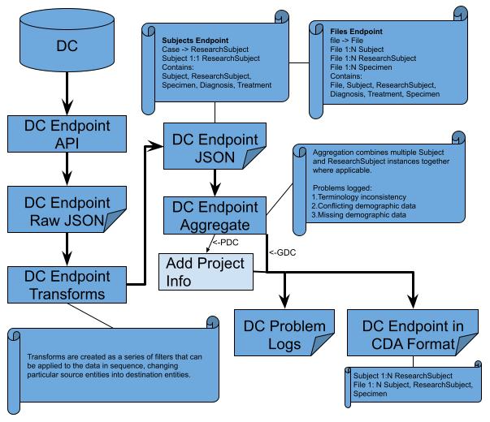
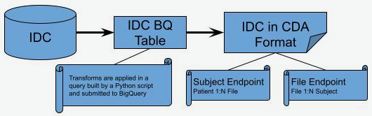

# CDA Extraction Transfer and Load (ETL) Documentation
## Introduction
The goal of this document is to record in greater detail the ETL process which the CDA uses to create the aggregated data tables which the API layer queries. A brief overview of the process to generate an endpoint table is seen below in Fig.1. Data from the Data Commons (DC), [GDC](https://portal.gdc.cancer.gov/) and [PDC](https://pdc.cancer.gov/pdc/), undergo a similar process including extraction using publicly available API’s, and transformation into a structure based on the CCDH model. [IDC](https://portal.imaging.datacommons.cancer.gov/) data is queried and transformed using a single BigQuery query. The results of this query are saved and merged with the transformed GDC and PDC data and uploaded to BigQuery as a table that is queried by the CDA API.

## Data extraction and release information
The current version and release dates for each of the database are:

* GDC data version - v33.1, GDC extraction date - 06/23/2022
* PDC data version - v2.7, PDC extraction date - 06/23/2022
* IDC data version - v.9.0, IDC extraction date - 06/24/2022

## R3.0 ETL Achievements
The achievements for R3.0 are outlined as follows:

* Previous table format now called Subjects endpoint
    * Replaced all File entities with Files - a list of file ids associated with the entity that the list is located in. e.g
        * File -> Files
        * ResearchSubject.File -> ResearchSubject.Files
        * ResearchSubject.Specimen.File -> ResearchSubject.Specimen.Files
* Files endpoint added:
    * Endpoint oriented around File information
    * Includes all information regarding the file's associated entities(Subject, ResearchSubject, and Specimen)
* Updated all DC data to latest versions available as of 06/23/2022

## R3.0 ETL Process Overview

Data from each DC (GDC, PDC, and IDC) is extracted and transformed independently. The case and file endpoints of GDC and PDC are queried via their publicly available API's to create case and file endpoint extracted data files(GDC case data, GDC file data, PDC case data, and PDC file data). Each extracted data file undergoes a transformation and aggregation step prior to being ready for merger with all of the other DCs transformed and aggregated data. At this point, all data from GDC and PDC are in the harmonized data schema, and representative of Subject and File endpoints in the CDA data schema.  IDC Subjects and Files endpoints data files are created using a single BigQuery query from IDC's available table. These data files do not require additional aggregation prior to being ready for merger with GDC and PDC. All of the Subjects endpoint data files from each DC are then merged into a Subjects endpoint, and all of the Files endpoint files are merged into a Files endpoint. These two files are then uploaded to BigQuery as two separate tables. One for all Subjects and one for all Files. The CDA API can query from these two tables. An overview of the entire process can be seen in Figure 1 and will be described in more detail below.

|  |
|:---:|
| **Figure 1** |

### Current Flow of ETL

The extraction and transformation process for GDC and PDC data are very similar. They can be broken into two sub-processes. The first includes extraction of the data from their cases and files endpoints, and transforming the data from the individual DC into the CCDH inspired data format. The second step merges the transformed data from both DCs into our Subjects and Files endpoints data formats.

#### GDC/PDC Cases and Files Extraction and Transformation

|  |
|:---:|
| **Figure 2** |

The extraction process for each node and endpoint implements the publicly available APIs exposed by the nodes. All the information that is used within CDA Release 3 for GDC has been obtained from the _cases_ and _files_ endpoints. Information from PDC is pulled from _cases_, _files_, _program_,  and _general_ endpoints. The majority of fields are coming from the _cases_ endpoint. The _files_ endpoint is used to get the files information and provide the link from files to associated specimens and cases. The resulting structure incorporates details about the case along with details about the files which are associated with the corresponding case, and specimens found within that case. In GDC, there are files that only link to cases, but any file that is linked to a specimen is also linked to the case that the specimen belongs to. The data files created by the extraction process are written with one case/**ResearchSubject** or file/**File** per line. These extracted data files are then submitted to the transformation code. The code reads the extracted data files line by line, and transforms each line into the data structure expected in our BigQuery tables.

Since the extracted data file and the output of the transform code are written as one case/**ResearchSubject** per line, whereas our data structure is on a **Subject** by **Subject** basis, further aggregation of the data is needed for the Subjects endpoint. Aggregation of **Subject** entities in the **File** endpoint data file is also required. The aggregation code searches for any entries in the transformed data which have identical ids (**Subject** level id) and aggregates those entries together. Currently, for the **Subject** endpoint, the demographic information is coalesced between cases, whereas the **ResearchSubject** and **File** records from different cases are appended. For the **File** endpoint,the demographic information is coalesced between cases for the **Subject** entities. The error logs for the individual DC examine the demographic data of two or more correlating **Subject**/**ResearchSubject** records and logs any discrepancy.

#### IDC Subjects and Files Extraction and Transformation

|  |
|:---:|
| **Figure 3** |

The extraction and transformation process of IDC data takes a more concise approach. One query for the Subjects endpoint is executed to extract all data from IDC and transform it into the CDA Subjects schema. A similar query is run for the creation of the Files endpoint data. Since IDC does not have demographic information, there is no need to do any logging of aggregation errors like that done in GDC and PDC.


#### Merger of GDC, PDC, and IDC Data

|  |
|:---:|
| **Figure 4** |

The merging of data between GDC, PDC, and IDC is very similar to the aggregation step in the extraction and transformation sub-process for GDC and PDC. For the Subjects endpoint, the merge code searches the GDC, PDC, and IDC Subjects files for matching ids, coalesces the demographic information (GDC taking priority over PDC), and appends **ResearchSubject** and **File** records. An Inter-DC log consisting of discrepancies between GDC and PDC demographic information is created. For the Files endpoint, the merge code reads all of the **Subject** entity information created from the merged Subjects endpoint file just created, and replaces all **Subject** entities within the Files endpoint, with the information found in the merged Subjects endpoint file. The now merged Subjects and Files endpoint files are then uploaded to BigQuery as our Subjets and Files endpoint tables.

## Appendix

### GDC Extraction
#### Cases Endpoint Data
All the fields that are currently available through the CDA Subjects endpoint are pulled from the _cases_ endpoint. Since files information can be also obtained through the _cases_ endpoint (see files record under [GDC documentation for case fields](https://docs.gdc.cancer.gov/API/Users_Guide/Appendix_A_Available_Fields/#case-fields)), but only as a record that is linked to the case entity, GDC Extract step utilizes _files_ endpoint to enable linking files with specimens:

<table>
    <caption><b>Table 1</b>. JSON on the left represents raw data that is pulled from the GDC API using _cases_ endpoint. On the right, we can see the final, processed JSON that includes <b>files</b> records under all specimen type entities. The complete list of fields that are used can be found <a href="../../Schema/overview_mapping">here</a>.</caption>
<tr>
<th>GDC Extract w/out File/Specimen Link</th>
<th>GDC Extract with File/Specimen Link</th>
</tr>
<tr>
<td>
<pre>
{
  case_id: value,
  ...
  project: {...},
  demographic: {...},
  diagnoses: [...],
  samples: [
    {
      ...
      portions: [
        {
         ...
         slides: [...],
         analytes: [
           {
             ...
             aliquots: [...]
            }
          ]
        }
      ]
    }
  ],
  files: [...]
}
</pre>
</td>
<td>
<pre>
{
  case_id: value,
  ...
  project: {...},
  demographic: {...},
  diagnoses: [...],
  samples: [
    {
      ...
      files: [...],
      portions: [
        {
          ...
          files: [...],
          slides: [
            {
              ...
              files: [...],
          analytes: [
            {
              ...
              files: [...],
              aliquots: [
                {
                  ...
                  files: [...]
                }
              ]
            }
          ]
        }
      ]
    }
  ],
  files: [...]
}

</pre>
</td>
</tr>

</table>

To be able to associate files and specimen entities, the `file_id`, `cases.samples.sample_id`, `cases.samples.portions.portion_id`, `cases.samples.portions.slides.slide_id`, `cases.samples.portions.analytes.analyte_id`, and `cases.samples.portions.analytes.aliquots.aliquot_id` fields from the _files_ endpoint were used (see [GDC documentation for file fields](https://docs.gdc.cancer.gov/API/Users_Guide/Appendix_A_Available_Fields/#file-fields)).

#### Files Endpoint Data
All the fields that are currently available through the CDA Files endpoint are pulled from the [_files_ endpoint](https://docs.gdc.cancer.gov/API/Users_Guide/Appendix_A_Available_Fields/#file-fields). For extraction, no extra information or joining of data from the _cases_ endpoint is necessary.

### PDC Extraction

To get the PDC data, six graphQL queries were used:

* filesMetadata
* allPrograms
* paginatedCaseDemographicsPerStudy
* paginatedCaseDiagnosesPerStudy
* paginatedCasesSamplesAliquots
* biospecimenPerStudy

First the _files_ endpoint is queried to get all file information, as well as linkages from files to aliquots, samples, and cases. This information is saved in a _files_ cache file. Next, all case and specimen information is extracted using the remaining queries. During the extraction of the case information, file_id information is joined to the associated cases and specimens. After all case information has been gathered and saved, the _files_ cache file info is read through, and information about relevant cases, aliquots, and samples are added.

#### Creating _Files_ Cache File
The only query used is filesMetadata. This query creates a the _files_ cache file that contains all of the _files_ endpoint information, indcluding all information about files, and the ids of associated cases, samples, and aliquots.

#### Extract All _Cases_ Information

The next query – allPrograms – is used to get all the available Programs and Studies. The extraction code loops over all Programs and Studies and performs several queries for each PDC study. Most queries are from the _cases_ endpoint and include paginatedCaseDemographicsPerStudy, paginatedCaseDiagnosesPerStudy, and paginatedCasesSamplesAliquots. They are used to gather the demographics, diagnoses, and specimen records for all cases within the study. biospecimenPerStudy is used solely to determine the taxon/species of the cases in the study. For each case and specimen in the study, file information is added from the _files_ cache file created by the filesMetadata query. Due to extracting case information by PDC study, some case information is duplicated in the extracted file since cases can be seen in more than one PDC study. The result looks as follows for a single PDC case record after adding file information:


```
{
  case_id: value,
  ...
  demographics: [...],
  diagnoses: [...],
  samples: [
    {
      ...
      files: [...],
      aliquots: [
        {
          ...
          files: [...]
        }
      ]
    }
  ],
  files: [...]
}
```
The complete list of fields that are used can be found <a href="../../Schema/overview_mapping">here</a>.

#### Add Case and Specimen Info to _Files_ Cache File
After all _cases_ information has been extracted, and _file_ information added where necessary, case and specimen data are added to the _files_ cache file.
<table>
    <caption><b>Table 2</b>. JSON on the left represents raw data that is pulled from the PDC API using the _files_ endpoint. On the right, we can see the final, processed JSON that includes cases, samples, and aliquots records under all file entities. The complete list of fields that are used can be found [<a href="../../Schema/overview_mapping">here</a>.</caption>
<tr>
<th>PDC _Files_ Extract w/out _Cases_ and _Specimen_ info</th>
<th>PDC _Files_ Extract with _Cases_ and _Specimen_ info</th>
</tr>
<tr>
<td>
<pre>
{
  file_id: value,
  ...
  aliquots: [
    {
      aliquot_id: value,
      sample_id: value,
      case_id: value
    },
    {
      aliquot_id: value,
      sample_id: value,
      case_id: value
    },
    ...
  ]
}
</pre>
</td>
<td>
<pre>
{
  file_id: value,
  ...
  cases: [
    {
      case_id: value
      ...
      samples: [
        {
            sample_id: value,
            ...
            aliquots: [
                {
                    aliquot_id: value,
                    ...
                },
                ...
            ]
        },
        ...
      ]
    },
    ...
  ]
}
</pre>
</td>
</tr>
</table>

### GDC and PDC Transformation

Transformation in this section can for the most part be broken into two steps. The first transformation step has both structural and simple field name changes to the extracted data files. This first step implements mapping files for GDC _cases_/Subjects endpoint, GDC _files_/Files endpoint, PDC _cases_/Subjects endpoint, and PDC _files_/Files endpoint. The details of this process are slightly different for each DC and endpoint, however the end result is the same. Each entry in the resultant Subjects file still correlates to a case/**ResearchSubject**, but is in an equivalent structure to the final schema where each entry will correspond to a Subject. In this file, Subjects may correspond to multiple entries and must be aggregated together. Each entry in the resultant Files file correlates to a file/**File**, so no aggregation is required at the top level, but aggregation is needed in the **Subject** entities for the same reason aggregation is needed in the Subject file.

The second step aggregates Subjects together from the same DC. In the Subjects file, for all entries that belong to the same **Subject**, the **ResearchSubject** records are appended underneath the same **Subject** entity. After this step, the data from each DC is in a common data format and ready for merging.

For this section, the DC’s are similar enough that the differences can be shown with the aforementioned mapping from GDC/PDC fields to the common data format found <a href="../../Schema/overview_mapping">here</a>.


##### step 1: Transformation

For GDC and PDC, we iterate over every entry from the extracted data files and make specific changes to that entry. For the Subjects file, these include creating a top **Subject** level of data which correlates to the **Subject** entity as defined by the CCDH model. From there, the specific case information is recorded in a **ResearchSubject** entity, and transformations to the fields are changed to align best with the CCDH model. At the end of this transformation step, each entry is still representative of a case, now known as a **ResearchSubject**, but has **Subject** level information. A simplified example of an entry is given below in Table 3.

<table>
    <caption><b>Table 3</b></caption>
<tr>
<th>Case Entry 1</th>
<th>Transformed Case Entry 1</th>
</tr>
<tr>
<td>
<pre>
{
  submitter_id: S1
  case_id: C3
  demographics:
    {days_to_birth: 45}
  primary_disease_site: Brain
  files:
    {file_id: file_1.doc}
    {file_id: file_2.txt}
  samples:
    {sample_id: samp_1
    files:
      {file_id: file_2.txt}
    }
}
</pre>
</td>
<td>
<pre>
{
  id: S1
  days_to_birth: 45
  ResearchSubject:
    {id: C3
    primary_disease_site: Brain
    Files:[file_1.doc, file_2.txt]
    Specimen:
      {id: samp_1,
       Files:[file_2.txt]
      }
    }
  Files[file_1.doc, file_2.txt]
}
</pre>
</td>
</tr>
</table>

Much like the Subjects file, the transformation of the Files file includes creating a top **File** level of data which correlates to the **File** entity as defined by the CCDH model. From there, the case information is used to create **Subject** entities as well as **ResearchSubject** entities, and transformations to the fields are changed to align best with the CCDH model. At the end of this transformation step, each entry within the **Subject** is still representative of a case, now known as a **ResearchSubject**, but has **Subject** level information (just like in the Subjects file transformation). A simplified example of an entry is given below in Table 4.

<table>
    <caption><b>Table 4</b></caption>
<tr>
<th>File Entry 1</th>
<th>Transformed File Entry 1</th>
</tr>
<tr>
<td>
<pre>
{
  file_id: file_1.txt
  cases:
    [
      {case_id: case_1,
       submitter_id: S1,
       samples:[...]
      },
      {case_id: case_2,
       submitter_id: S1,
       samples:[...]
      }
    ]
}
</pre>
</td>
<td>
<pre>
{
  id: file_1.txt
  Subject:
    [
      {id: S1},
      {id: S1}
    ]
  ResearchSubject:
    [
      {id: case_1},
      {id: case_2}
    ]
  Specimen:[...]
}
</pre>
</td>
</tr>
</table>

##### step 2: Aggregation

At this point for the transformed Subjects file, a list of Subjects and corresponding ResearchSubjects is made, and any **Subject** with multiple **ResearchSubject** records has the **ResearchSubject** and **File** records appended (with duplicates removed from **File** (and **ResearchSubject** in PDC)) under a single entry for the **Subject**. A simplified example of this aggregation can be seen in Table 5 below.

<table>
    <caption><b>Table 5</b></caption>
<tr>
<th>Transformed Subject Entry 1</th>
<th>Transformed Subject Entry 2</th>
<th>Aggregated</th>
</tr>
<tr>
<td>
<pre>
{
  id: S1
  days_to_birth: 45
  ResearchSubject:
    {id: C3
    primary_disease_site: Brain
    Files: [file_1.doc, file_2.txt]
    Specimen:
      {id: samp_1,
       Files: [file_2.txt]
      }
    }
  Files: [file_1.doc, file_2.txt]
}
</pre>
</td>
<td>
<pre>
{
  id: S1
  days_to_birth: 45
  ResearchSubject:
    {id: C7
    primary_disease_site: Brain
    Files: [file_1.doc, file_5.txt]
    Specimen:
      {id: samp_4,
       Files: [file_5.txt]
      }
    }
  Files: [file_1.doc, file_5.txt]
}
</pre>
</td>
<td>
<pre>
{
  id: S1
  days_to_birth: 45
  ResearchSubject:
    {id: C3
    primary_disease_site: Brain
    Files: [file_1.doc, file_2.txt]
    Specimen:
      {id: samp_1
      Files: [file_2.txt]
      }
    },
    {id: C7
    primary_disease_site: Brain
    Files: [file_1.doc, file_5.txt]
    Specimen:
      {id: samp_4
      Files: [file_5.txt]
      }
    }
  Files: [file_1.doc, file2.txt, file_5.txt]
}
</pre>
</td>
</tr>
</table>

Transformed Subject Entry 1 and 2 are aggregated in this example. Transformed Subject Entry 1 and 2 both correspond to the **Subject** with the id ‘S1’, but have different **ResearchSubject** records, and overlapping entries in their **Subject** level **File** records (file_1.doc is in both). The aggregated entry appended the **ResearchSubject** records together and appended the **File** records together while removing the duplicate entry.

For the transformed Files file, a list of Subjects and ResearchSubjects is made, and any **Subject** or **ResearchSubject** with multiple records has them merged into a single entry for the **Subject** or **ResearchSubject**. A simplified example of this aggregation can be seen in Table 6 below.

<table>
    <caption><b>Table 6</b></caption>
<tr>
<th>Transformed File Entry 1</th>
<th>Aggregated</th>
</tr>
<tr>
<td>
<pre>
{
  id: File1
  Subject:
    [
        {id: S1},
        {id: S1},
        {id: S2}
    ],
  ResearchSubject:
    [
        {id: RS2},
        {id: RS2},
        {id: RS3}
    ],
  Specimen:
    [
        {id: samp_1},
    ]
}
</pre>
</td>
<td>
<pre>
{
  id: File1
  Subject:
    [
        {id: S1},
        {id: S2}
    ],
  ResearchSubject:
    [
        {id: RS2},
        {id: RS3}
    ],
  Specimen:
    [
        {id: samp_1},
    ]
}
</pre>
</td>
</tr>
</table>

### IDC Extraction and Transformation

For Release 3, the IDC extraction and transformation process are executed using one query. This is possible due to IDC making their data available on BigQuery, as well as other features of BigQuery including temporary functions, array aggregation of structured data, and grouping data by particular fields (id, species, etc.). The queries currently used for the Subjects and Files endpoints are:
```
# Subjects Endpoint Query
CREATE TEMP FUNCTION
  idc_species_mapping(x STRING)
  RETURNS STRING AS (CASE x
      WHEN 'Human' THEN 'Homo sapiens'
      WHEN 'Canine' THEN 'Canis familiaris'
      WHEN 'Mouse' THEN 'Mus musculus'
    ELSE
    ''
  END
    );
CREATE TEMP FUNCTION
  idc_SUBSTR(x STRING)
  RETURNS STRING AS (SUBSTR(x, 15));
CREATE TEMP FUNCTION
  idc_drs_uri(x STRING)
  RETURNS STRING AS (CONCAT("drs://dg.4DFC:", x));
SELECT
  PatientID AS id,
  [STRUCT('IDC' AS system,
    PatientID AS value)] AS identifier,
  idc_species_mapping(tcia_species) AS species,
  STRING(NULL) AS sex,
  STRING(NULL) AS race,
  STRING(NULL) AS ethnicity,
  NULL AS days_to_birth,
  [collection_id] AS subject_associated_project,
  STRING(NULL) AS vital_status,
  NULL AS age_at_death,
  STRING(NULL) AS cause_of_death,
  ARRAY_AGG(crdc_instance_uuid) AS Files
FROM
  `canceridc-data.idc_v4.dicom_pivot_v4`
GROUP BY
  id,
  species,
  collection_id
```
```
# Files Endpoint Query
CREATE TEMP FUNCTION
  idc_species_mapping(x STRING)
  RETURNS STRING AS (CASE x
      WHEN 'Human' THEN 'Homo sapiens'
      WHEN 'Canine' THEN 'Canis familiaris'
      WHEN 'Mouse' THEN 'Mus musculus'
    ELSE
    ''
  END
    );
CREATE TEMP FUNCTION
  idc_SUBSTR(x STRING)
  RETURNS STRING AS (SUBSTR(x, 15));
CREATE TEMP FUNCTION
  idc_drs_uri(x STRING)
  RETURNS STRING AS (CONCAT("drs://dg.4DFC:", x));
SELECT
  crdc_instance_uuid AS id,
  [STRUCT('IDC' AS system,
    crdc_instance_uuid AS value)] AS identifier,
  idc_SUBSTR(gcs_url) AS label,
  'Imaging' AS data_category,
  STRING(NULL) AS data_type,
  'DICOM' AS file_format,
  collection_id AS associated_project,
  idc_drs_uri(crdc_instance_uuid) AS drs_uri,
  NULL AS byte_size,
  STRING(NULL) AS checksum,
  'Imaging' AS data_modality,
  Modality AS imaging_modality,
  STRING(NULL) AS dbgap_accession_number,
  [STRUCT(PatientID AS id,
    [STRUCT('IDC' AS system,
      PatientID AS value)] AS identifier,
    idc_species_mapping(tcia_species) AS species,
    STRING(NULL) AS sex,
    STRING(NULL) AS race,
    STRING(NULL) AS ethnicity,
    NULL AS days_to_birth,
    [collection_id] AS subject_associated_project,
    STRING(NULL) AS vital_status,
    NULL AS age_at_death,
    STRING(NULL) AS cause_of_death)] AS Subject
FROM
  `canceridc-data.idc_v4.dicom_pivot_v4`
GROUP BY
  id,
  gcs_url,
  Modality,
  collection_id,
  PatientID,
  tcia_species
```

#### Temp Functions

The temporary functions created include `idc_species_mapping`, `idc_substr`, and `idc_drs_uri`. These functions are used to transform the IDC fields `tcia_species`, `gcs_url`, and `crdc_instance_uuid` to the CDA data schema fields `species`, `File.label`, and `File.drs_uri`. As more fields become available, and more transformations are necessary, more temporary functions will be added.

#### SELECT ‘x’ AS ‘y’

Due to the nature of the query, all fields desired in the CDA schema must be specified. The query is built using a mapping file similar to the GDC and PDC mapping files. If it is a direct mapping such as `PatientID` to id, then simply `PatientID` AS id works. For fields that require some type of transformation like `File.label` or `species`, the function is added to the query (eg `idc_species_mapping(tcia_species)` AS `species`). For integer type fields that have no mapping to IDC, `NULL` is mapped and for string type fields, `STRING(NULL)` is mapped. Any fields that have a string mapped to a field will be populated by the string listed (eg. 'DICOM' AS `file_format`). The IDC mapping file can be found [here](https://github.com/CancerDataAggregator/transform/blob/integration/IDC_mapping.yml).

#### FROM and GROUP BY

This statement selects which table from IDC to query from, as well as how to aggregate the data. It is grouped by `id` (**Subject** level `identifier`), then `species` and `collection_id` to keep with proper BigQuery formatting.

### Merge
#### Subjects Endpoint Merger
After the data from GDC, PDC, and IDC have been transformed into a common data format, merging the data together can begin. For the Subjects endpoint, **Subject** level info is coalesced, and any data from records in **ResearchSubject** are simply appended underneath the same **Subject**, and the **Subject** Files lists are appended together. A simplified example of the merge between GDC, PDC, and IDC data can be seen in Table 7.

<table>
    <caption><b>Table 7</b>. Simplified example of a merger between GDC, PDC, and IDC</caption>
<tr>
<th>GDC</th>
<th>PDC</th>
<th>IDC</th>
<th>Merged</th>
</tr>
<tr>
<td>
<pre>
{
  id: A
  days_to_birth: 23
  race: None
  sex: M
  ResearchSubject:
    {id: A1
    ...
    }
    {id: A2
    ...
    }
  Files: [file_G1.doc]
}
</pre>
</td>
<td>
<pre>
{
  id: A
  days_to_birth: None
  race: Caucasian
  sex: F
  ResearchSubject:
    {id: B4
    ...
    }
    {id: B5
    ...
    }
  Files: [file_P1.doc]
}
</pre>
</td>
<td>
<pre>
{
  id: A
  days_to_birth:
  race:
  sex:
  Files: [file_I1.doc]
}
</pre>
</td>
<td>
<pre>
{
  id: A
  days_to_birth: 23
  race: Caucasian
  sex: M
  ResearchSubject:
    {id: A1
    ...
    }
    {id: A2
    ...
    }
    {id: B4
    ...
    }
    {id: B5
    ...
    }
  Files: [file_G1.doc, file_P1.doc, file_I1.doc]
}
</pre>
</td>
</tr>
</table>

##### Subject level merge

The fields at the **Subject** level are merged based on coalescing data. The code looks for values in GDC, then PDC, and then IDC until a value is found. The first value found is used in the merged data. (if there is conflicting data, this is logged). In Figure 2, id under **Subject** must be the same to consider merging data. The example for days_to_birth shows that GDC has a value of 23, whereas PDC shows none. Since GDC has a populated value, the value from GDC is stored as the value for days_to_birth. Similarly, for race, GDC has no recorded value but PDC has a value of ‘Caucasian’. Since GDC is empty, and PDC has a value, the value from PDC is stored. The final example shows conflicting data between GDC and PDC. GDC records sex as ‘M’ whereas PDC records it as ‘F’. Due to conflicting information, this instance is recorded in a log, but the GDC value of ‘M’ is used in the merged data.

##### ResearchSubject level append

Looking at Table 7, in the merged data, all of the records from **ResearchSubject** from GDC and PDC are appended. At this time there is no equivalent **ResearchSubject** entity available for IDC data. Currently no merging happens at this level.

##### File level append

Looking at Table 7, in the merged data, all of the records from **File** from GDC, PDC, and IDC are appended. Currently no merging happens at this level.

For the Subjects endpoint, **Subject** level info is coalesced, and any data from records in **ResearchSubject** are simply appended underneath the same **Subject**, and the **Subject** Files lists are appended together. A simplified example of the merge between GDC, PDC, and IDC data can be seen in Table 7.

<table>
    <caption><b>Table 7</b>. Simplified example of a merger between GDC, PDC, and IDC</caption>
<tr>
<th>GDC</th>
<th>PDC</th>
<th>IDC</th>
<th>Merged</th>
</tr>
<tr>
<td>
<pre>
{
  id: A
  days_to_birth: 23
  race: None
  sex: M
  ResearchSubject:
    {id: A1
    ...
    }
    {id: A2
    ...
    }
  Files: [file_G1.doc]
}
</pre>
</td>
<td>
<pre>
{
  id: A
  days_to_birth: None
  race: Caucasian
  sex: F
  ResearchSubject:
    {id: B4
    ...
    }
    {id: B5
    ...
    }
  Files: [file_P1.doc]
}
</pre>
</td>
<td>
<pre>
{
  id: A
  days_to_birth:
  race:
  sex:
  Files: [file_I1.doc]
}
</pre>
</td>
<td>
<pre>
{
  id: A
  days_to_birth: 23
  race: Caucasian
  sex: M
  ResearchSubject:
    {id: A1
    ...
    }
    {id: A2
    ...
    }
    {id: B4
    ...
    }
    {id: B5
    ...
    }
  Files: [file_G1.doc, file_P1.doc, file_I1.doc]
}
</pre>
</td>
</tr>
</table>

#### Files Endpoint Merger ####

Since there are no shared files between any of the DC's, no top level **File** information can be merged. The problem is that there is no easy way to correct the **Subject** entity information strictly from the Files endpoint file. For this reason, CDA merges the Subjects endpoint information first, and uses the records from the fully merged Subjects endpoint to overwrite the corresponding **Subject** entities found in the Files endpoint. A simplified example of the this is shown in Table 8.

<table>
    <caption><b>Table 8</b>. Simplified example of a merger between GDC, PDC, and IDC</caption>
<tr>
<th>Relevant Merged Subject</th>
<th>Unmerged File Record</th>
<th>File w/ Merged Subjects</th>
</tr>
<tr>
<td>
<pre>
{
  id: A
  days_to_birth: 23
  race: Caucasian
  sex: M
  ResearchSubject:
    {id: A1
    ...
    }
    {id: A2
    ...
    }
  Files: [file_G1.doc]
}
</pre>
</td>
<td>
<pre>
{
  id: F1
  Subject:
    [
        {id: A
        days_to_birth: None
        race: None
        sex: M
        }
    ]
  ResearchSubject:
    {id: B4
    ...
    }
    {id: B5
    ...
    }
}
</pre>
</td>
<td>
<pre>
{
  id: F1
  Subject:
    [
        {id: A
        days_to_birth: 23
        race: Caucasian
        sex: M
        }
    ]
  ResearchSubject:
    [
        {id: B4
        ...
        },
        {id: B5
        ...
        },
    ]
}
</pre>
</td>
</tr>
</table>

##### Subject level merge

The fields at the **Subject** level are overwritten by the **Subject** information found in the fully merged Subjects endpoint. The record for the **Subject** entity with id = A is missing demographic information in the Files endpoint data. This can happen when another DC contains this missing information. As such, the **Subject** entity information is overwritten by that found in the fully merged Subjects endpoint.
