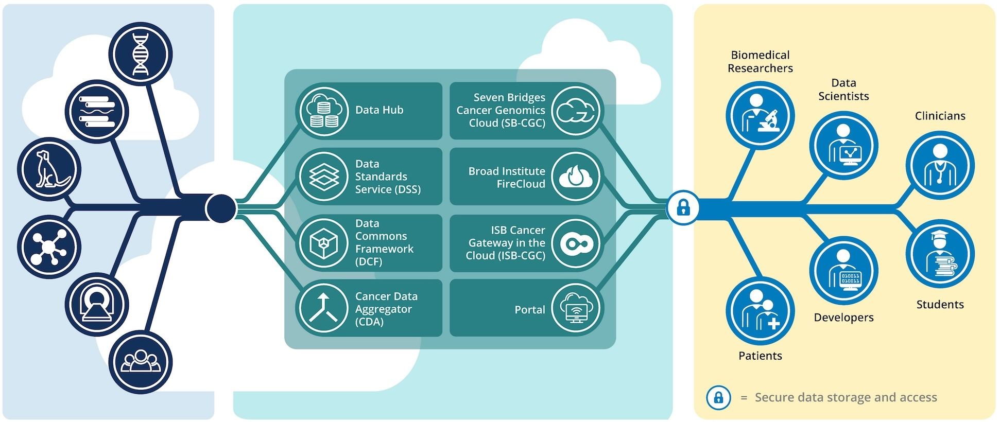
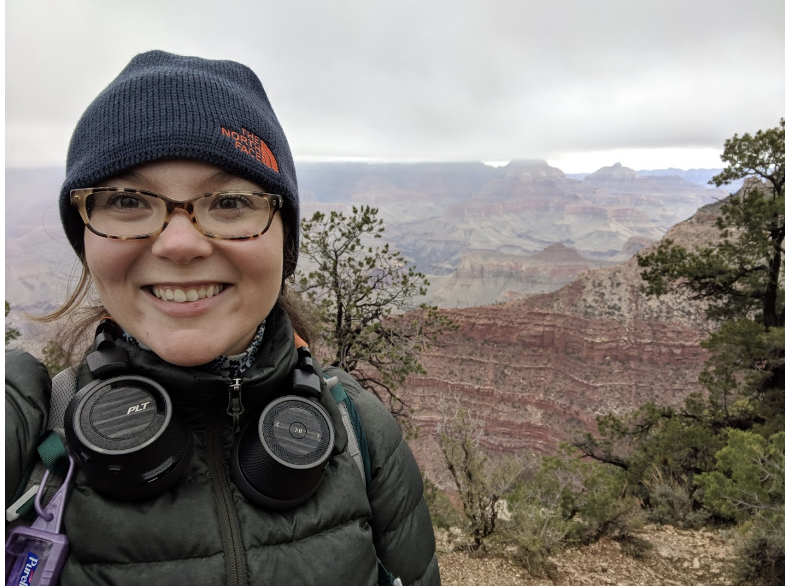

# About us

The Cancer Data Aggregator is a service of the National Cancer Institutes' (NCI) Cancer Research Data Commons. We pull metadata for thousands of studies hosted at multiple data repositories across NCI, and make it available for search from a single tool so researchers can more easily find and reuse existing cancer research data. In between pulling and publishing, we thoroughly clean, harmonize, and cross-reference the metadata so you can easily do things like find subjects that have participated in multiple studies, discover data from a disease that was originally described in different ways at each repository, and compile all the data from your favorite program such as CPTAC - no matter where it ended up. 

To learn more about how we make metadata ready for search, head to our [about our data](./ourdata.md) page.

To learn more about how to access and work with data you find using CDA, visit the CRDC [Cloud Resources](https://datacommons.cancer.gov/analyze/analytical-tools) page

## About the Cancer Research Data Commons

The [Cancer Research Data Commons:octicons-link-external-16:](https://datacommons.cancer.gov/){:target="_blank"} (CRDC) is a cloud-based data science infrastructure that provides secure access to a large, comprehensive, and expanding collection of cancer research data. Users can explore and use analytical and visualization tools for data analysis in the cloud.

## Our team

    

    
-   <figure>
    
    <figcaption>Arthur Brady
Data wrangling & Developer</figcaption>
</figure>

-   <figure>
    
    <figcaption>Amanda Charbonneau 
Testing & Directing</figcaption>
</figure>
-   <figure>
    
    <figcaption>Tanner Coon 
Developer</figcaption>
</figure>
-   <figure>
    
    <figcaption>David Pot
Principal Investigator</figcaption>
</figure>

## Alumni

-   <figure>
    
    <figcaption>Bing-Xing Huo
Principal Investigator - Broad</figcaption>
</figure>
-   <figure>
    
    <figcaption>Finny Thomas 
Developer</figcaption>
</figure>
-   <figure>
    
    <figcaption>Surya Saha 
Project Manager - Velsera</figcaption>
</figure>
-   <figure>
    
    <figcaption>Jack DiGiovanna 
Principal Investigator - Velsera</figcaption>
</figure>
-   <figure>
    
    <figcaption>Rachel Kutner 
Developer & Project Management</figcaption>
</figure>

-   <figure>
    
    <figcaption>Kat Thayer 
Project Management</figcaption>
</figure>

-   <figure>
    
    <figcaption>Alex Baumann 
Principal Investigator - Broad</figcaption>
</figure>

## Funding

This project has been funded in whole or in part with Federal funds from the National Cancer Institute, National Institutes of Health, Task Order No. 17X053 under Contract No. HHSN261200800001E
