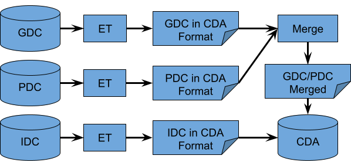

# CDA Extraction Transfer and Load (ETL) Documentation
## Introduction
The goal of this document is to record in greater detail the ETL process which the CDA uses to create the aggregated data table which the API layer queries. A brief overview of the entire process is seen below in Fig.1. Data from the Data Commons (DC), [GDC](https://portal.gdc.cancer.gov/) and [PDC](https://pdc.cancer.gov/pdc/), undergo a similar process including extraction using publicly available API’s, and transformation into a structure based on the CCDH model before being merged together and loaded to BigQuery. IDC data is queried and transformed using a single BigQuery query. The results of this query are saved as a table in BigQuery. The merged GDC/PDC table and [IDC](https://portal.imaging.datacommons.cancer.gov/) table are merged in a view that is queried by the CDA API.

## Data extraction and release information
To identify the current version and release dates for each of the database, you can run the following command:

```
r = Q.sql("SELECT option_value FROM `gdc-bq-sample.integration.INFORMATION_SCHEMA.TABLE_OPTIONS` WHERE table_name = 'all_v1'")
strings = r[0]['option_value'].split('\\n')
new_strings = []

for string in strings:
    new_string = string.replace('\"', '')
    new_strings.append(new_string)
print(new_strings)
```

Which will produce the following output:
['GDC extraction date - 09/27/2021', 'GDC data release - v30.0', 'PDC extraction date - 09/27/2021', 'PDC data release - v2.1', 'IDC extraction date - 09/27/2021', 'IDC data release - Version 3.0']

## R2 ETL Achievements
The achievements for R2 are outlined as follows:

* Added IDC data into the CDA data repo
* Restructured how CDA handles **File** entities
    * Populate **File** entities for all specimen types instead of only sample types.
    * Added **File** entities to the **Subject** and **ResearchSubject** entities which list files associated with each.
* Altered ETL to use a mapping file for transformations in order to more easily support adding additional nodes.
* Data release information of GDC, PDC, and IDC that has been extracted, transformed, and loaded is available on the BigQuery tables (and queryable!)

## R2 ETL Process Overview

Each DC (GDC, PDC, and IDC) is extracted and transformed individually. GDC and PDC data are merged together prior to loading, whereas IDC is loaded individually. In BigQuery, there are two separate tables. One for GDC and PDC merged, the second is IDC by itself. These two tables are then merged in a view, and the CDA API typically queries from the resulting view. An overview of this process can be seen in Figure 1 and will be described in more detail below.


|  |
|:---:|
| **Figure 1** |


<figure>
   <b> Figure 1 </b> </figcaption>
</figure>

### Current Flow of GDC and PDC ETL

The ETL processes for GDC and PDC data are very similar. They can be broken into two sub-processes. The first includes extraction of the data, and transforming the data from the individual DC into the CCDH inspired data format. The second step merges the transformed data from both DCs.

#### Extraction and Transformation

<figure>
   <b> Figure 2 </b> </figcaption>
</figure>

The extraction process for each node implements the publicly available APIs exposed by the nodes. All the information that is used within CDA Release 2 for GDC has been obtained from the _cases_ and _files_ endpoints. Information from PDC is pulled from _cases_, _files_, _program_,  and _general_ endpoints. The majority of fields are coming from the _cases_ endpoint. The _files_ endpoint is used to get the files information and provide the link from files to associated specimens and cases. The resulting structure incorporates details about the case along with details about the files which are associated with the corresponding case, and specimens found within that case. In GDC, there are files that only link to cases, but any file that is linked to a specimen is also linked to the case that the specimen belongs to. The file created by the extraction process is written with one case/**ResearchSubject** per line. This extracted file is then submitted to the transformation code. The code reads the extracted file line by line, and transforms each line into the data structure expected in our BigQuery tables. 

Since the extracted data and the output of the transform code are written on a case by case / **ResearchSubject** by **ResearchSubject** basis, whereas our data structure is on a **Subject** by **Subject** basis, further aggregation of the data is needed. The aggregation code searches for any entries in the transformed data which have identical ids (**Subject** level id) and aggregates those entries together. Currently, the demographic information is coalesced between cases, whereas the **ResearchSubject** and **File** records from different cases are appended. The error logs for the individual DC examine the demographic data of two or more correlating **Subject**/**ResearchSubject** records and logs any discrepancy. After aggregation has occurred for both GDC and PDC, the next sub-process is ready to be performed.


#### Merger of GDC and PDC Data

<figure>
   <b> Figure 3 </b> </figcaption>
</figure>

The merging of data between GDC and PDC is very similar to the aggregation step in the extraction and transformation sub-process. The merge code searches the GDC and PDC files for matching ids, coalesces the demographic information (GDC taking priority over PDC), and appends **ResearchSubject** and **File** records. An Inter-DC log consisting of discrepancies between GDC and PDC demographic information is created.

### IDC Flow

#### Direct From IDC BigQuery Table/View

<figure>
   <b> Figure 4 </b> </figcaption>
</figure>

The ETL process of IDC data takes a more concise approach. A single query is executed to extract all data from IDC and transform it into the CDA schema. Since IDC does not have demographic information, there is no need to do any logging of aggregation errors like that done in GDC and PDC.


### Merging GDC/PDC with IDC


#### A Single Query to Create a Merged View

To merge the GDC/PDC table with the IDC table, CDA implements a procedure that is very similar to the one used to create the merged GDC/PDC table. Subjects with the same id are merged and **File** information from both tables are appended. The id fields are coalesced since all merged subject records have the same id. The identifier, subject_associated_project, and **File** records are appended, and the demographic info along with **ResearchSubject** records are taken from the GDC/PDC table since IDC does not contain that information. The query used to implement this merger, and create the view that the CDA API queries from is shown in the appendix.

## Appendix

### GDC and PDC

#### GDC Extraction

All the fields that are currently available through the CDA are pulled from the _cases_ endpoint. Since files information can be also obtained through the _cases_ endpoint (see files record under [GDC documentation for case fields](https://docs.gdc.cancer.gov/API/Users_Guide/Appendix_A_Available_Fields/#case-fields)), but only as a record that is linked to the case entity, GDC Extract step utilizes _files_ endpoint to enable linking files with specimens:

<table>
    <caption><b>Table 1</b>. JSON on the left represents raw data that is pulled from the GDC API using _cases_ endpoint. On the right, we can see the final, processed JSON that includes **files** record under all specimen type entities. The complete list of fields that are used can be found [here](https://docs.google.com/spreadsheets/d/1S4qxo_D-mKF_N7C-m8KV7Wbs-Nzeif_itpMrJwwEPOc/edit?usp=sharing).</caption>
<tr>
<th>GDC Extract w/out File/Specimen Link</th>
<th>GDC Extract with File/Specimen Link</th>
</tr>
<tr>
<td>
<pre>
{
  case_id: value,
  ...
  project: {...},
  demographic: {...},
  diagnoses: [...],
  samples: [
    {
      ...
      portions: [
        {
         ...
         slides: [...],
         analytes: [
           {
             ...
             aliquots: [...]
            }
          ]
        }
      ]
    }
  ],
  files: [...]
}
</pre>
</td>
<td>
<pre>
{
  case_id: value,
  ...
  project: {...},
  demographic: {...},
  diagnoses: [...],
  samples: [
    {
      ...
      files: [...],
      portions: [
        {
          ...
          files: [...],
          slides: [
            {
              ...
              files: [...],
          analytes: [
            {
              ...
              files: [...],
              aliquots: [
                {
                  ...
                  files: [...]
                } 
              ]
            }
          ]
        }
      ]
    }
  ],
  files: [...]
}

</pre>
</td>
</tr>
    
</table>

To be able to associate files and specimen entities, the `file_id`, `cases.samples.sample_id`, `cases.samples.portions.portion_id`, `cases.samples.portions.slides.slide_id`, `cases.samples.portions.analytes.analyte_id`, and `cases.samples.portions.analytes.aliquots.aliquot_id` fields from the _files_ endpoint were used (see [GDC documentation for file fields](https://docs.gdc.cancer.gov/API/Users_Guide/Appendix_A_Available_Fields/#file-fields)).

It is worth reiterating that there are files which are solely associated with cases and not associated with specimens. These are now available in Release 2.


#### PDC Extraction

To get the PDC data, six graphQL queries were used:

* filesMetadata
* allPrograms
* paginatedCaseDemographicsPerStudy
* paginatedCaseDiagnosesPerStudy
* paginatedCasesSamplesAliquots
* biospecimenPerStudy

The first query used is filesMetadata. This query creates a cache file that contains a dictionary where the keys are sample or aliquot ids, and the values are lists of file ids associated with that sample or aliquot. 

The next query – allPrograms – is used to get all the available Programs and Studies. The extraction code loops over all Programs and Studies and performs several queries for each PDC study. Most queries are from the cases endpoint and include paginatedCaseDemographicsPerStudy, paginatedCaseDiagnosesPerStudy, and paginatedCasesSamplesAliquots. They are used to gather the demographics, diagnoses, and specimen records for all cases within the study. biospecimenPerStudy is used solely to determine the taxon/species of the cases in the study. For each case and specimen in the study, file information is added from the cache file created by the filesMetadata query. The result looks as follows for a single PDC case record after adding file information:


```
{
  case_id: value,
  ...
  demographics: [...],
  diagnoses: [...],
  samples: [
    {
      ...
      files: [...],
      aliquots: [
        {
          ...
          files: [...]
        }
      ]
    }
  ],
  files: [...]
}
```
The complete list of fields that are used can be found [here](https://docs.google.com/spreadsheets/d/1S4qxo_D-mKF_N7C-m8KV7Wbs-Nzeif_itpMrJwwEPOc/edit?usp=sharing).


#### Transformation

Transformation in this section can for the most part be broken into two steps. The first transformation step has both structural and simple field name changes to the extracted data files. The details of this process are slightly different for each DC, however the end result is the same. Each entry in the resultant file still correlates to a case/**ResearchSubject**, but is in an equivalent structure to the final schema where each entry will correspond to a Subject. In this file, Subjects may correspond to multiple entries and must be aggregated together.

The second step aggregates Subjects together from the same DC. For all entries that belong to the same **Subject**, the **ResearchSubject** records are appended underneath the same **Subject** entity. After this step, the data from each DC is in a common data format and ready for merging. 

For this section, the DC’s are similar enough that the differences can be shown with a simple mapping from GDC/PDC fields to the common data format found [here](https://docs.google.com/spreadsheets/d/1C3iyOYN9R1UGFMa7EazHxtsabPOPlT0vvAPRDGQXPZI/edit?usp=sharing).


##### step 1: Transformation

For GDC and PDC, we iterate over every entry from the extracted data file and make specific changes to that entry. These include creating a top **Subject** level of data which correlates to the **Subject** entity as defined by the CCDH model. From there, the specific case information is recorded in a **ResearchSubject** entity, and transformations to the fields are changed to align best with the CCDH model. At the end of this transformation step, each entry is still representative of a case, now known as a **ResearchSubject**, but has **Subject** level information. A simplified example of an entry is given below in Table 2.

<table>
    <caption><b>Table 2</b></caption>
<tr>
<th>Entry 1</th>
<th>Transformed Entry 1</th>
</tr>
<tr>
<td>
<pre>
{
  submitter_id: S1
  case_id: C3
  demographics:
    {days_to_birth: 45}
  primary_disease_site: Brain
  files:
    {file_id: file_1.doc}
    {file_id: file_2.txt}
  samples:
    {sample_id: samp_1
    files:
      {file_id: file_2.txt}
    }
}
</pre>
</td>
<td>
<pre>
{
  id: S1
  days_to_birth: 45
  ResearchSubject:
    {id: C3
    primary_disease_site: Brain
    File:
      {id: file_1.doc}
      {id: file_2.txt}
    Specimen:
      {id: samp_1
      File:
        {id: file_2.txt}
      }
    }
  File:
    {id: file_1.doc}
    {id: file_2.txt}
}
</pre>
</td>
</tr>
</table>


##### step 2: Aggregation 

At this point, a list of Subjects and corresponding ResearchSubjects is made, and any **Subject** with multiple **ResearchSubject** records has the **ResearchSubject** and **File** records appended (with duplicates removed from **File**) under a single entry for the **Subject**. A simplified example of this aggregation can be seen in Table 3 below.

<table>
    <caption><b>Table 3</b></caption>
<tr>
<th>Transformed Entry 1</th>
<th>Transformed Entry 2</th>
<th>Aggregated</th>
</tr>
<tr>
<td>
<pre>
{
  id: S1
  days_to_birth: 45
  ResearchSubject:
    {id: C3
    primary_disease_site: Brain
    File:
      {id: file_1.doc}
      {id: file_2.txt}
    Specimen:
      {id: samp_1
      File:
        {id: file_2.txt}
      }
    }
  File:
    {id: file_1.doc}
    {id: file_2.txt}
}
</pre>
</td>
<td>
<pre>
{
  id: S1
  days_to_birth: 45
  ResearchSubject:
    {id: C7
    primary_disease_site: Brain
    File:
      {id: file_1.doc}
      {id: file_5.txt}
    Specimen:
      {id: samp_4
      File:
        {id: file_5.txt}
      }
    }
  File:
    {id: file_1.doc}
    {id: file_5.txt}
}
</pre>
</td>
<td>
<pre>
{
  id: S1
  days_to_birth: 45
  ResearchSubject:
    {id: C3
    primary_disease_site: Brain
    File:
      {id: file_1.doc}
      {id: file_2.txt}
    Specimen:
      {id: samp_1
      File:
        {id: file_2.txt}
      }
    },
    {id: C7
    primary_disease_site: Brain
    File:
      {id: file_1.doc},
      {id: file_5.txt}
    Specimen:
      {id: samp_4
      File:
        {id: file_5.txt}
      }
    }
  File:
    {id: file_1.doc},
    {id: file2.txt}
    {id: file_5.txt}
}
</pre>
</td>
</tr>
</table>

Transformed Entry 1 and 2 are aggregated in this example. Transformed Entry 1 and 2 both correspond to the **Subject** with the id ‘S1’, but have different **ResearchSubject** records, and overlapping entries in their **Subject** level **File** records (file_1.doc is in both). The aggregated entry appended the **ResearchSubject** records together and appended the **File** records together while removing the duplicate entry.


#### Merge

After the data from GDC and PDC have been transformed into a common data format, merging the data together can begin. **Subject** level info is coalesced, and any data from records in **ResearchSubject** and **File** are simply appended underneath the same **Subject**. A simplified example of the merge between GDC and PDC data can be seen in Table 4.

<table>
    <caption><b>Table 4</b>. Simplified example of a merger between GDC and PDC</caption>
<tr>
<th>GDC</th>
<th>PDC</th>
<th>Merged</th>
</tr>
<tr>
<td>
<pre>
{
  id: A
  days_to_birth: 23
  race: None
  sex: M
  ResearchSubject:
    {id: A1
    ...
    }
    {id: A2
    ...
    }
  File:
    {id: file_G1.doc
    ...
    }
}
</pre>
</td>
<td>
<pre>
{
  id: A
  days_to_birth: None
  race: Caucasian
  sex: F
  ResearchSubject:
    {id: B4
    ...
    }
    {id: B5
    ...
    }
  File:
    {id: file_P1.doc
    ...
    }
}
</pre>
</td>
<td>
<pre>
{
  id: A
  days_to_birth: 23
  race: Caucasian
  sex: M
  ResearchSubject:
    {id: A1
    ...
    }
    {id: A2
    ...
    }
    {id: B4
    ...
    }
    {id: B5
    ...
    }
  File:
    {id: file_G1.doc
    ...
    }
    {id: file_P1.doc
    ...
    }
}
</pre>
</td>
</tr>
</table>

##### Subject level merge

The fields at the **Subject** level are merged based on coalescing data. The code looks for values in GDC then PDC until a value is found. The first value found is used in the merged data, unless there is strictly conflicting data. In Figure 2, id under **Subject** must be the same to consider merging data. The example for days_to_birth shows that GDC has a value of 23, whereas PDC shows none. Since GDC has a populated value, and PDC has none, the value from GDC is stored as the value for days_to_birth. Similarly, for race, GDC has no recorded value but PDC has a value of ‘Caucasian’. Since GDC is empty, and PDC has a value, the value from PDC is stored. The final example shows conflicting data between GDC and PDC. GDC records sex as ‘M’ whereas PDC records it as ‘F’. Due to conflicting information, this instance is recorded in a log, but the GDC value of ‘M’ is used in the merged data.

##### ResearchSubject level append

Looking at Table 4, in the merged data, all of the records from **ResearchSubject** from GDC and PDC are appended. Currently no merging happens at this level.

##### File level append

Looking at Table 4, in the merged data, all of the records from **File** from GDC and PDC are appended. Currently no merging happens at this level.

### IDC

#### IDC Extraction and Transformation

For Release 2, the IDC extraction and transformation process are executed using one query. This is possible due to IDC making their data available on BigQuery, as well as other features of BigQuery including temporary functions, array aggregation of structured data, and grouping data by particular fields (id, species, etc.). The query currently used is:

```
CREATE TEMP FUNCTION idc_species_mapping(x STRING) 

RETURNS STRING AS 

(CASE x WHEN 'Human' THEN 'Homo sapiens' WHEN 'Canine' THEN 'Canis familiaris' 

WHEN 'Mouse' THEN 'Mus musculus' ELSE ''END); 

CREATE TEMP FUNCTION idc_substr(x STRING) 

RETURNS STRING AS (SUBSTR(x, 15));  

SELECT PatientID AS id, 

[STRUCT('IDC' AS system, PatientID AS value)] AS identifier, 

STRING(NULL) AS sex, 

STRING(NULL) AS race, 

STRING(NULL) AS ethnicity, 

Null AS days_to_birth, 

idc_species_mapping(tcia_species) AS species, 

[collection_id] AS subject_associated_project, 

ARRAY_AGG(STRUCT(crdc_instance_uuid AS id, 

[STRUCT('IDC' AS system, crdc_instance_uuid AS value)] AS identifier,

idc_substr(gcs_url) AS label, 

'Imaging' AS data_category, 

Modality AS data_type, 

'DICOM' AS file_format, 

collection_id AS associated_project, 

gcs_url AS drs_uri, 

Null AS byte_size, 

STRING(NULL) AS checksum) ) as File 

FROM `canceridc-data.idc_v4.dicom_pivot_v4` 

GROUP by id, species, collection_id
```

##### Temp Functions

The temporary functions created include `idc_species_mapping` and `idc_substr`. These functions are used to transform the IDC fields `tcia_species` and `gcs_url` to the CDA data schema fields `species` and `File.label`. As more fields become available, and more transformations are necessary, more temporary functions will be added.

##### SELECT ‘x’ AS ‘y’

Due to the nature of the query, all fields desired in the CDA schema must be specified. The query is built using a mapping file similar to the GDC and PDC mapping files. If it is a direct mapping such as `PatientID` to id, then simply `PatientID` AS id works. For fields that require some type of transformation like `File.label` or `species`, the function is added to the query (eg `idc_species_mapping(tcia_species)` AS `species`). For integer type fields that have no mapping to IDC, `NULL` is mapped and for string type fields, `STRING(NULL)` is mapped. Any fields that have a string mapped to a field will be populated by the string listed (eg. 'DICOM' AS `file_format`). The IDC mapping file can be found [here](https://github.com/CancerDataAggregator/transform/blob/integration/IDC_mapping.yml).

##### FROM and GROUP BY

This statement selects which table from IDC to query from, as well as how to aggregate the data. It is grouped by `id` (**Subject** level `identifier`), then `species` and `collection_id` to keep with proper BigQuery formatting. 

### Merge GDC/PDC and IDC

The query used to merge the GDC/PDC and IDC tables on BigQuery is shown below.
```
SELECT COALESCE(t1.id, t2.id) as id,

ARRAY_CONCAT(

    t1.identifier,

    t2.identifier

) as identifier,

t1.sex,

t1.race,

t1.ethnicity,

t1.days_to_birth,

ARRAY_CONCAT(

    t1.subject_associated_project,

    t2.subject_associated_project

) as subject_associated_project,

ARRAY_CONCAT(

    IFNULL(t1.File, []),

    IFNULL(t2.File, [])

    ) as File,

t1.ResearchSubject

FROM `gdc-bq-sample.integration.gdc_pdc` t1

FULL OUTER JOIN `gdc-bq-sample.integration.idc_v4` t2 ON t1.id = t2.id
```
