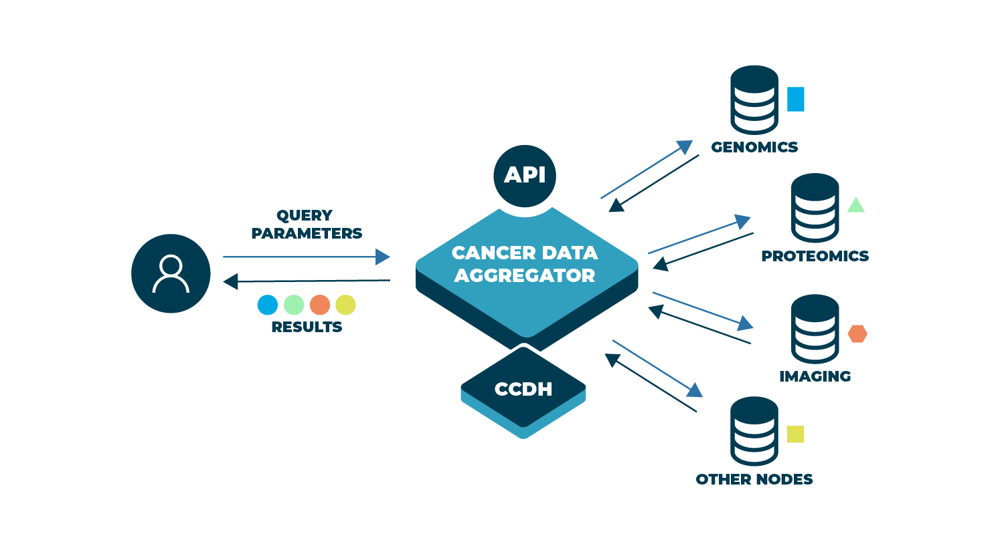

# CDA Release 2

## Release Notes

Last updated: October 15th, 2021

### Introduction to CDA

The Release 2 of CDA searches across data from the Genomics Data Commons (GDC), the Proteomics Data Commons (PDC), and the Imaging Data Commons (IDC) to aggregate and return data to users via a single application programming interface (API). CDA leverages the work and data model that is concurrently being developed by the [Center for Cancer Data Harmonization](https://datascience.cancer.gov/data-commons/center-cancer-data-harmonization-ccdh) (CCDH). CCDH will provide a single data model that harmonizes syntax and semantics across the CRDC systems and services. 

The CCDH data model promises to be a specimen-centric model whereas current CRDC nodes tend to use a case-centric approach.  The diagrams below depict the shift from the respective GDC and PDC entity models (provided by CCDH - Figure 1) towards a specimen-centric model (Figure 2).

|  |
|:---:|
| **Figure 1**: The PDC and GDC data models are case centric. |

|  |
|:---:|
| **Figure 2**: CCDH is moving towards a specimen centric model. |

As the CCDH model develops, CDA leverages the harmonization work of the [CCDH model](https://cancerdhc.github.io/ccdhmodel/entities/) by extending the model only where necessary, such as adding key search fields, to support CDA functionality.  CDA periodically synchronizes with CCDH to maintain consistency between the  [data model](https://github.com/CancerDataAggregator/cda-data-model) implemented in CDA and the developing CCDH model.  This data model is expressed as JSON Schema.

|  |
|:---:|
| **Figure 3**: The <a href="https://github.com/CancerDataAggregator/cda-data-model">data model</a> is expressed as JSON schema. |

In Figure 3, the entities rimmed in blue are not yet part of the CCDH model but are extensions to allow CDA to aggregate and deliver data as the CCDH model evolves. It may be helpful to think about your queries in terms of these entities (e.g. Specimen, Patient, Research Subject, Project, Diagnosis) and their attributes (e.g. derived_from_subject, ethnicity, reference_assembly).

When the data is fully harmonized, finding data for a specific patient or a specific specimen across all nodes will be simplified.  For Release 1, CDA was able to identify common patients across GDC and PDC in cases where the PDC “case_submitter_id” is equal to the GDC “submitter_id”, essentially harmonizing this field. Further alignment was achieved by using lower case characters consistently. For Release 2, CDA similarly merged IDC with GDC and PDC data by matching IDC “PatientID” with GDC “submitter_id” and PDC “case_submitter_id”.

To assist you with the transition to CCDH data model terminology, we have provided a field by field mapping of terms from the GDC, PDC[^1], and IDC data dictionaries to the implemented JSON schema. This information can be found in [CDA Schema Field Mapping](./Schema.md).

For details on the extraction, transformation, load (ETL) process, please see CDA ETL Process.

## Datasets & Fields

* Imaging Data Commons added
* All datasets updated as follows
    * GDC: v30.0, 09/27/2021
    * PDC: v2.1, 09/27/2021
    * IDC: v.3.0, 09/27/2021
* Now associate File entity with Patient and ResearchSubject entity
* All types of specimens have Files

## Enhanced query functionality

* Added Docker for enabling quickstart
* Enhanced Q functionality to more mimic natural language
* Support for long queries
* Added asynchronous hooks, ability to do searches in parallel
* Can write raw SQL queries
* Can check status of BigQuery to see if the source data table is up in Q
* Unique values and columns return faster than in Release 1

## Metadata Changes

* See [CDA Schema Field Mapping](https://docs.google.com/spreadsheets/d/1S4qxo_D-mKF_N7C-m8KV7Wbs-Nzeif_itpMrJwwEPOc/edit?usp=sharing)
* Summary
    * Patient was renamed to Subject to align with CRDC-H model
    * Add files records to the Subject and ResearchSubject (repeat from above)
    * Newly available fields include:
        * Subject:
            * identifier.system
            * identifier.value
            * species
            * Subject_associated_project
        * Diagnosis:
            * identifier.system
            * identifier.value
        * Treatment:
            * id
            * identifier.system
            * identifier.value
            * days_to_treatment_start
            * days_to_treatment_end
    * Renamed fields (old -> new):
        * Diagnosis:
            * tumor_grade -> grade
            * tumor_stage -> stage
        * Treatment:
            * type -> treatment_type
            * outcome -> treatment_outcome
    * IDC data available in Subject, and Subject.File entities.
        * drs_uri field is not currently available for IDC data

## Bug fixes

* Fixed problem of unnested items would appear at the top level in the JSON response, resulting in duplication of elements
* Fixed cda-service overwrites query columns with same name
* Added support for the API queries to asynchronous calls.
* Added a unique-values API endpoint for returning distinct values in the cda table
* There is a new status endpoint which will verify that the cda_mvp tables are available.   Please let the dev team know if there is additional info that would be useful from this endpoint in the future.  "total table rows, size of schemas etc"
* Support the ability to query development tables being used for integrating the IDC data with the existing PDC and GDC data. If your jupyter notebooks fail to execute, you will likely have to reload the cda-python into your python virtual environment.

## Known bugs and issues

* `unique_terms` are not sorted when they return
* tumor stages are not harmonized, there are redundant terms (complicates query)
* Days_to_birth should be reformatted (currently negative) or have an example query
* Docker jupyter notebook does not work if a notebook is already open in port 8888

<!-- Footnotes themselves at the bottom. -->

[^1]:
     Information pulled from the PDC API may contain embargoed data. 
